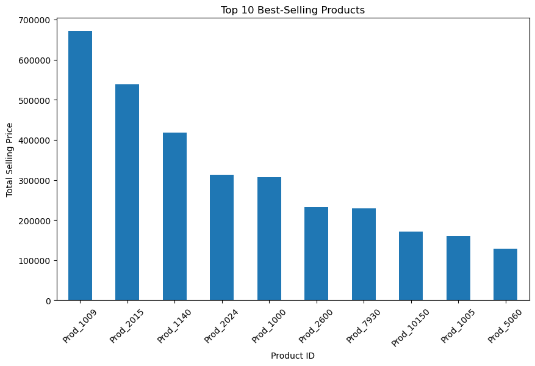

# Product Recommendation using Deep Learning with Graph Convolutional Networks and Graph Attention Networks

### Data Preprocessing
First, I import the necessary libraries and load the data from a CSV file (`UrbanEdgeApparel.csv`) into a pandas DataFrame (`df`). To ensure data quality, I define a `preprocess` function that handles various preprocessing tasks. This includes converting data types, such as date columns to datetime format and categorical columns to the category data type, handling missing values, and dropping duplicates. After preprocessing, I inspect the DataFrame's information to ensure everything looks good.

### Graph Creation
Moving on, I import the `networkx` library for graph manipulation. Here, I define a function called `create_graph` to construct a graph representation from the DataFrame. This function iterates over each order and adds edges between products that are purchased together. The resulting graph `G` is then displayed, showing the number of nodes and edges.

### Exploratory Analysis
Before diving into modeling, I conduct exploratory analysis on the data. This involves grouping the DataFrame by 'Order ID' and extracting unique product IDs for each order. I calculate and print the average number of products ordered and visualize the top 10 best-selling products using a bar plot.

### Time Series Forecasting
Next, I perform time series forecasting using the Prophet library. I aggregate the 'Total Selling Price' column based on the 'Order Date' to create a time series. Then, I train the Prophet model on the data up to a certain date ('2023-01-01') and test it on the remaining data. I calculate metrics such as Mean Absolute Error (MAE), Root Mean Squared Error (RMSE), and Mean Absolute Percentage Error (MAPE), and visualize the forecast and trend components.

 

### Graph Visualization
To better understand the relationships between products, I visualize the graph created earlier using the `pyvis` library. This interactive visualization is displayed in an HTML format, allowing for exploration of the graph structure.

### Graph Convolutional Network (GCN)
Now, I move on to building a GCN-based recommendation model using PyTorch and the `torch_geometric` library. I define the architecture of the GCN model within the `GNNRecommendationModel` class. After training the model, I print training metrics such as loss, accuracy, precision, recall, and F1-score. Finally, I save the trained model to a file ('gnn_recommendation_model.pth') for future use.

    

### Graph Attention Network (GAT)
Similarly, I implement a GAT-based recommendation model. The architecture of the GAT model is defined within the `GATRecommendationModel` class. After training the model, I print training metrics and save the trained model to a file ('gat_recommendation_model.pth').

    

### Trade-offs between GCN and GAT for Product Recommendations

To evaluate the performance of both the GCN and GAT models, I calculate various metrics such as Mean Average Precision (MAP), Normalized Discounted Cumulative Gain (NDCG), and Area Under the Receiver Operating Characteristic curve (AUC-ROC). Additionally, I compute recommendation-specific metrics like precision, recall, F1-score, and coverage. Various plots are generated to visualize the performance of the recommendation models and the distribution of recommended items.

When comparing the performance of Graph Convolutional Networks (GCN) and Graph Attention Networks (GAT) for product recommendations, several trade-offs emerge based on the evaluation metrics:

- **Mean Average Precision (MAP):**
  - GCN: 0.0406
  - GAT: 0.0345
  - **Trade-off:** GCN outperforms GAT in terms of MAP, indicating that GCN provides better precision in recommending relevant products compared to GAT.

- **Normalized Discounted Cumulative Gain (NDCG) at 10:**
  - GCN: 0.0389
  - GAT: 0.0372
  - **Trade-off:** GCN marginally outperforms GAT in NDCG@10, suggesting that GCN's recommendations are slightly more relevant in the top recommendations compared to GAT.

- **Area Under the Receiver Operating Characteristic curve (AUC-ROC):**
  - GCN: 0.586
  - GAT: 0.663
  - **Trade-off:** GAT outperforms GCN significantly in terms of AUC-ROC, indicating that GAT achieves better overall discrimination performance in distinguishing relevant products from irrelevant ones.

### Interpretation and Valuable Insights:

- **Precision vs. Discrimination Performance:**
  - GCN excels in providing precise recommendations, particularly for top-ranked items. This precision can be valuable in scenarios where accuracy in the top recommendations is crucial, such as personalized recommendations for high-value customers.
  - GAT, on the other hand, demonstrates superior discrimination ability, making it more adept at distinguishing relevant products across the entire recommendation list. This capability could be advantageous in broader recommendation systems catering to a diverse customer base.

- **Next Steps and Recommendations:**
  - **GCN Refinement:** Given GCN's superior precision, further refinement and optimization of GCN models could enhance its performance even more, particularly in capturing nuanced patterns and relationships among products and customers.
  - **GAT Integration:** While GAT shows promising discrimination performance, integrating its strengths with GCN models could lead to a hybrid approach that combines precision and discrimination, potentially offering more balanced and effective product recommendations.
  - **Evaluation on Real-world Data:** Conducting experiments with real-world data sets and user feedback can provide more insights into the practical effectiveness of both GCN and GAT models in actual product recommendation scenarios. This iterative process of evaluation and refinement is crucial for continuously improving recommendation systems.

### Save Model
Finally, I save the trained GCN model to a file for future use. This ensures that the model can be easily loaded and used in other applications or for further analysis.

This comprehensive pipeline covers the necessary steps for building and evaluating product recommendation models using deep learning techniques. From data preprocessing to model training and evaluation, each step is carefully executed to ensure accurate and reliable recommendations.
